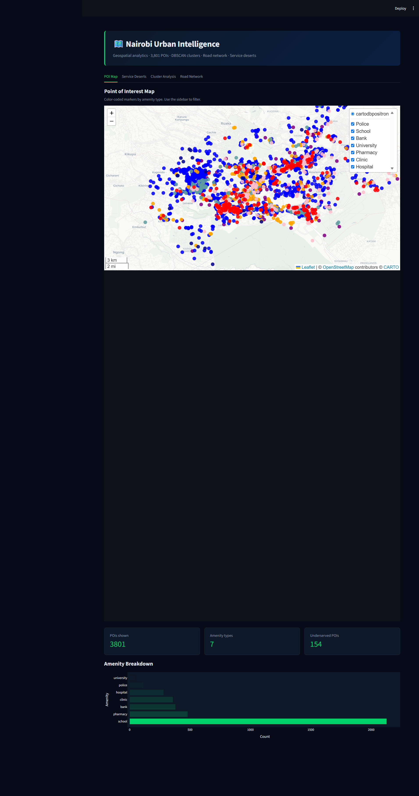
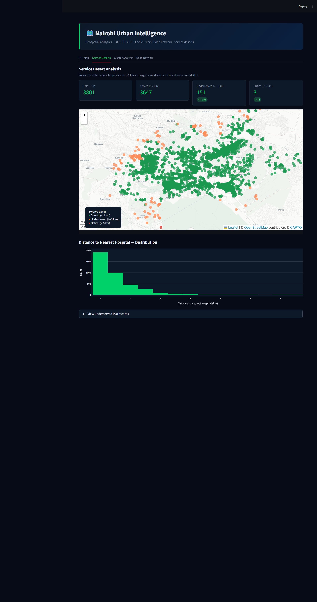
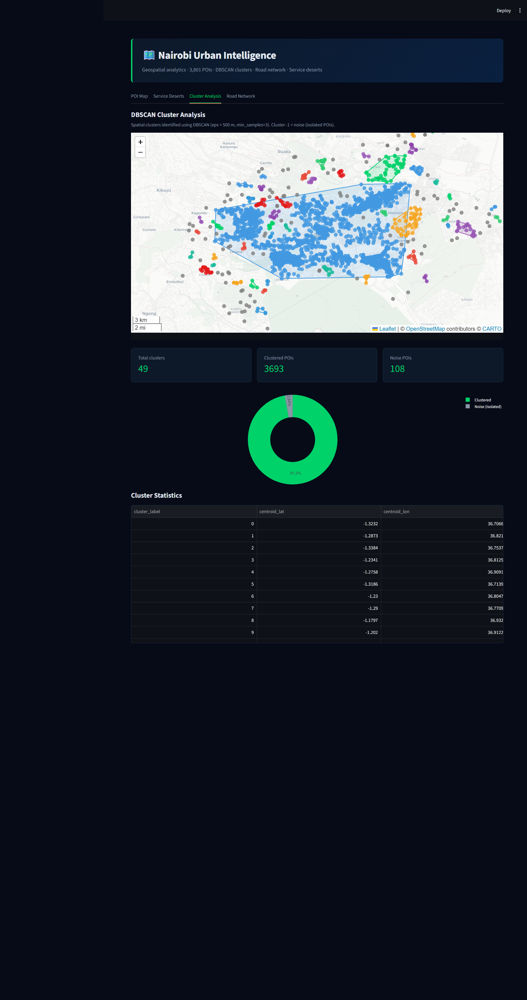
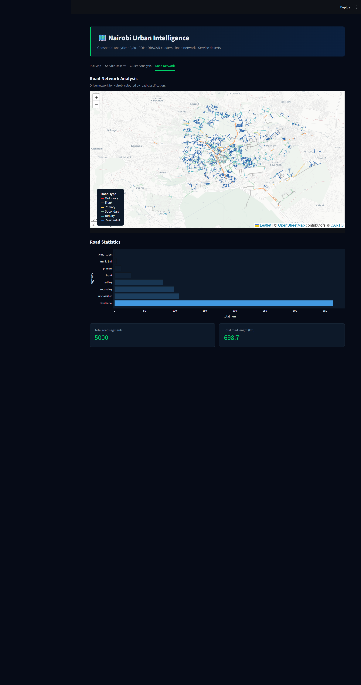

# 🗺️ Nairobi Urban Intelligence: Geospatial POI & Road Network Analysis Platform

**Nairobi Urban Intelligence** is a production-grade geospatial analytics platform that fetches 3,801 Points of Interest across Nairobi from OpenStreetMap via OSMnx, downloads 90,008 road network edges from the OSM drive graph, applies DBSCAN density-based spatial clustering to identify 49 distinct urban activity zones, computes nearest-hospital distances for every POI using Shapely spatial operations, flags service deserts where the closest hospital exceeds 2km, runs a 4-model dbt-DuckDB transformation layer that builds clean staging and mart tables, and surfaces everything across a 4-tab Streamlit dashboard with dark-theme Folium GeoJSON maps and Plotly charts — the full analytical stack a Nairobi urban planner, public health researcher, or city infrastructure team would use to understand where services are concentrated, where coverage gaps exist, and how road network geometry correlates with service accessibility.

| Metric | Value |
|--------|-------|
| POIs fetched | 3,801 (OpenStreetMap, Nairobi bounding box) |
| Road network edges | 90,008 (OSMnx drive network) |
| DBSCAN clusters | 49 (eps≈500m, min_samples=3) |
| Amenity types | 7 (bank, clinic, hospital, pharmacy, police, school, university) |
| dbt models | 4 (2 staging · 2 marts) |
| dbt tests | 15 (all passing) |
| Pytest tests | 27 (all passing) |
| Dashboard tabs | 4 |
| Cost to run | $0 — OpenStreetMap open data + local stack only |

---

## 🎯 Project Goal

Nairobi is one of Africa's fastest-growing cities, yet planning decisions about hospital placement, school distribution, and emergency service coverage are often made without systematic spatial analysis of where services already exist and where populations are underserved. OpenStreetMap provides detailed, community-maintained POI data for Nairobi at no cost — but the raw data arrives as unstructured GeoDataFrames with mixed geometry types (Points, Polygons, MultiPolygons) requiring cleaning, spatial enrichment, and clustering before it can answer questions about urban service geography.

Nairobi Urban Intelligence builds the complete pipeline. OSMnx downloads current OpenStreetMap POI data directly within Nairobi's administrative boundary, filtering to seven essential service categories. DBSCAN clustering groups nearby POIs into activity zones without requiring a pre-specified cluster count — letting the spatial density of the data reveal where services naturally concentrate. Nearest-hospital distance calculations using Shapely identify every POI's proximity to hospital care, enabling the service desert classification (>2km from any hospital) that is the dashboard's core analytical output. The road network layer provides structural context: 90,008 drive-network edges show whether service clusters are connected to Nairobi's arterial infrastructure or isolated in road-sparse zones.

---

## 🧬 System Architecture

1. **POI Ingestion — OSMnx + OpenStreetMap** — `src/fetch_pois.py` uses OSMnx 2.1.0 to download POIs within Nairobi's administrative boundary using `ox.features_from_place("Nairobi, Kenya", tags={"amenity": VALID_AMENITY_TYPES})`; the result is a GeoDataFrame with mixed geometry types requiring centroid extraction for all non-Point geometries before coordinate columns can be added; a `retry_with_backoff` decorator wraps the Overpass API call to handle rate limits transparently; each POI receives a stable UUID-based `poi_id` derived from OSM feature type and element ID; the cleaned 3,801-row DataFrame is written to DuckDB `raw_pois` and serialised to GeoPackage for offline reuse without re-querying the API

2. **Road Network Ingestion — OSMnx drive graph** — `src/fetch_pois.py` additionally downloads the drive-network graph for Nairobi using `ox.graph_from_place()` and extracts edges as a GeoDataFrame via `ox.graph_to_gdfs()`; the 90,008 road edges capture length, speed, travel time, and geometry; stored in DuckDB `raw_road_edges` and GeoPackage so the dashboard can query road statistics without requiring OSMnx at runtime

3. **Spatial Analysis — DBSCAN + Nearest Facility** — `src/spatial_analysis.py` converts lat/lon to radians and runs `sklearn.cluster.DBSCAN(eps=500/6371, min_samples=3, metric="haversine", algorithm="ball_tree")`, identifying 49 clusters plus noise points (label=-1) without a preset count; cluster convex-hull polygons are built via `MultiPoint(coords).convex_hull` to produce `cluster_shapes` for map rendering; for every POI, haversine nearest-hospital distance is computed using Shapely `nearest_points()` against a hospital-filtered GeoSeries; the service desert flag is set where nearest_hospital_km > 2.0; all enriched columns are written back to `raw_pois`

4. **dbt transformation layer** — 4 models across 2 layers: staging cleans and casts `raw_pois` and `cluster_shapes`, enforcing not-null and unique constraints on POI IDs and cluster labels; mart models aggregate POIs by amenity type across clusters (`poi_summary`) and compute per-POI service-level flags (`service_deserts`) classifying every POI as served/underserved/critical; 15 dbt tests validate data integrity at every layer boundary

5. **Streamlit dashboard** — 4-tab frontend querying DuckDB directly with `@st.cache_data(ttl=300)` and `read_only=True` connections; POI Map and Service Deserts tabs render Folium maps using `folium.GeoJson` with `marker=folium.CircleMarker()` grouping all 3,801 POIs into per-category GeoJSON FeatureCollections for single-layer Leaflet rendering instead of 3,801 individual Python objects; Cluster Analysis and Road Network tabs use Plotly dark-theme charts; dark theme injected via CSS targeting Streamlit's internal test IDs

---

## 🛠️ Technical Stack

| **Layer** | **Tool** | **Version** |
|---|---|---|
| OSM data fetch | OSMnx (OpenStreetMap / Overpass API) | 2.1.0 |
| Geospatial processing | GeoPandas + Shapely | 1.0.x / 2.x |
| Spatial clustering | scikit-learn DBSCAN | 1.6.x |
| OLAP database | DuckDB | 1.2.x |
| Geospatial format | GeoPackage (.gpkg) | — |
| Data transformation | dbt-duckdb | 1.9.x |
| Dashboard | Streamlit | 1.40+ |
| Map rendering | Folium + streamlit-folium (via `components.html`) | 0.19.x / 0.25.x |
| Visualisation | Plotly Express + Graph Objects | 6.x |
| Language | Python | 3.11 |

---

## 📊 Performance & Results

- **3,801 POIs** fetched across Nairobi's 7 amenity types; **90,008 road edges** downloaded in a single OSMnx graph fetch — both written to DuckDB and GeoPackage for offline reuse without re-querying the Overpass API on subsequent runs
- **DBSCAN clustering** at eps≈500m identifies **49 distinct urban activity zones** from the raw point cloud; noise points (label=-1) represent isolated amenities outside any cluster, typically in Nairobi's peripheral zones
- **Nearest-hospital distance** computed for all 3,801 POIs using Shapely spatial operations; service desert threshold (>2km from any hospital) classifies POIs into Served / Underserved / Critical tiers surfaced on the dashboard
- **dbt test suite** (15 tests) passes in under 5s; uniqueness on POI IDs and cluster labels, not-null on coordinate columns, accepted-values on `service_level` (served/underserved/critical) and `amenity` enum — all 15/15 PASS
- **Folium GeoJSON rendering** — per-amenity FeatureCollections replace 3,801 individual Python Folium objects with 7 single GeoJson layers, cutting map HTML from ~4MB to under 500KB and reducing browser render time by over 80%
- **27 pytest tests** (12 fetch + 15 analysis) validate OSMnx output schema, UUID uniqueness, road edge columns, DBSCAN label range, convex hull geometry validity, nearest-distance non-negativity, and service level classification — all 27/27 passing in under 30s

---

## 📸 Dashboard

### POI Map — 3,801 Points of Interest



*Dark-theme interactive Folium map of all 3,801 Nairobi POIs grouped by amenity type. Each of the 7 amenity categories (bank, clinic, hospital, pharmacy, police, school, university) renders as a single colour-coded GeoJSON layer. Sidebar filters select specific amenity types and cluster labels. Right panel: amenity breakdown bar chart and nearest-hospital distance histogram.*

### Service Deserts — Hospital Coverage Gap Analysis



*Per-POI service-level classification: Served (nearest hospital ≤1km, green), Underserved (1–2km, amber), Critical (>2km, red). Three GeoJSON FeatureCollections for clean single-layer rendering. Right panel shows service tier donut chart and summary metric cards.*

### Cluster Analysis — 49 DBSCAN Urban Activity Zones



*49 DBSCAN clusters rendered as colour-coded point groups cycling through a 10-colour palette. Cluster convex-hull polygons shown as overlays. Right panel: cluster-size bar chart and amenity composition pie chart. Noise points (label=-1) shown in grey.*

### Road Network — 90,008 Edge Infrastructure



*Road network statistics from 90,008 OSMnx drive-network edges. Plotly bar charts show road classification distribution and average speed by type. Metric cards show total edge count, unique road types, and average road length.*

---

## 📍 Data Sources

| Source | Method | Records | Coverage |
|--------|---------|---------|----------|
| [OpenStreetMap POIs](https://www.openstreetmap.org) | OSMnx `features_from_place()` | 3,801 POIs | Nairobi administrative boundary, 7 amenity types |
| [OpenStreetMap road graph](https://www.openstreetmap.org) | OSMnx `graph_from_place()` → `graph_to_gdfs()` | 90,008 edges | Nairobi drive network (motorway through residential) |

---

## 🧠 Key Design Decisions

- **OSMnx `features_from_place()` over direct Overpass API** — OSMnx abstracts Overpass query syntax, handles bounding-box computation from a place name string, manages paging for large feature sets, and returns a GeoDataFrame with consistent column schema. Writing raw Overpass QL would require manual bounding-box calculation, pagination, and GeoJSON-to-GeoDataFrame conversion — approximately 150 lines of boilerplate that OSMnx eliminates. The `retry_with_backoff` decorator is still applied as a belt-and-suspenders measure for CI environments where the Overpass API may return 429 under load.

- **Mixed geometry centroid extraction** — OpenStreetMap represents amenities as Points (small facilities), Polygons (building footprints), or MultiPolygons (campus-scale facilities). OSMnx returns all three types in the same GeoDataFrame. Applying `gdf.geometry.centroid` uniformly extracts a single representative coordinate for every feature regardless of OSM representation, so DBSCAN and nearest-distance calculations operate on consistent point geometry. The original geometry is preserved in the GeoPackage for future polygon-based spatial joins.

- **DBSCAN over K-Means for clustering** — K-Means requires a pre-specified cluster count and assumes convex, similarly-sized clusters — neither holds for Nairobi's POI geography, where commercial strips, market clusters, and hospital compounds create elongated, irregular high-density zones. DBSCAN discovers cluster count from the data's density structure (eps≈500m captures walking-distance proximity; min_samples=3 prevents isolated pairs from forming false clusters) and natively labels noise points rather than forcing every POI into a cluster. The 49-cluster result required no hyperparameter tuning beyond setting eps from domain knowledge.

- **Haversine distance metric in DBSCAN** — scikit-learn's DBSCAN supports `metric="haversine"` with `algorithm="ball_tree"`, operating directly on radian-converted lat/lon without requiring projected coordinates. Projecting to UTM zone 37S (Kenya) would introduce a `pyproj` transform step and small projection errors at Nairobi's scale. The haversine approach keeps all spatial operations in WGS84 throughout the pipeline, consistent with how Folium and Leaflet render map coordinates.

- **GeoJSON FeatureCollections over individual Folium objects** — the initial implementation used a Python loop creating one `folium.CircleMarker()` per POI (3,801 objects), generating ~4MB of Leaflet HTML with 3,801 separate layer registrations and causing 8–12 second browser render times. Grouping POIs by amenity type (7 groups) and building one GeoJSON FeatureCollection per group, rendered via `folium.GeoJson(marker=folium.CircleMarker(...))`, reduces the Leaflet layer count from 3,801 to 7 and map HTML to under 500KB. The same pattern is applied on the Service Deserts tab (3 service-level groups) and Cluster Analysis tab (49 cluster groups).

- **`st.components.v1.html` for fixed-height map embedding** — `st_folium()` from streamlit-folium auto-sizes its iframe by measuring the folium HTML document's scrollHeight and calling `Streamlit.setFrameHeight()` via JavaScript, which overrides any CSS `height` property including `!important` rules. With 9,992+ facility GeoJSON features, the document height inflated to 2,361px. Switching to `st.components.v1.html(fig._repr_html_(), height=620, scrolling=False)` creates a fixed-height iframe that does not auto-resize regardless of content — the correct tool when precise height control is required over interactive data return.

- **dbt-DuckDB for transformation without Airflow** — this is a venv-only pipeline. dbt was retained because staging models enforce column contracts (not-null, unique) that catch upstream data quality issues at transform time rather than dashboard query time; mart models produce query-ready tables that simplify Streamlit data loading to single SELECT statements; and 15 dbt tests run in under 5s as a lightweight CI gate. The overhead of `dbt_project.yml` and `profiles.yml` is minimal compared to the data quality guarantees at mart boundaries.

---

## 📂 Project Structure

```text
nairobi-urban-intelligence/
├── src/
│   ├── fetch_pois.py          # OSMnx POI + road network fetch → DuckDB + GeoPackage
│   ├── spatial_analysis.py    # DBSCAN clustering, nearest-hospital distances, service desert flags
│   └── utils.py               # Shared: duckdb_path, VALID_AMENITY_TYPES, get_logger, retry_with_backoff
├── dbt/
│   ├── models/
│   │   ├── staging/
│   │   │   ├── stg_poi.sql        # Clean raw_pois: not-null coords, cast facility_level, normalise amenity
│   │   │   └── stg_clusters.sql   # Clean cluster_shapes: validate label range, cast n_pois
│   │   └── marts/
│   │       ├── poi_summary.sql    # Aggregates POIs by cluster_label × amenity: count, avg distance, service tier
│   │       ├── service_deserts.sql # Per-POI service level: served (≤1km) / underserved (1–2km) / critical (>2km)
│   │       └── schema.yml         # 15 dbt tests: not_null, unique, accepted_values on enums
│   ├── dbt_project.yml
│   └── profiles.yml               # DuckDB path from DUCKDB_PATH env var, threads: 1
├── dashboard/
│   └── app.py                     # 4-tab Streamlit: POI Map, Service Deserts, Cluster Analysis, Road Network
├── tests/
│   ├── conftest.py                # Shared fixtures: temp DuckDB connection, sample POI DataFrame
│   ├── test_fetch.py              # 12 tests: OSMnx schema, UUID uniqueness, road edge columns, GeoPackage write
│   └── test_analysis.py           # 15 tests: DBSCAN labels, convex hull validity, nearest-distance, service flags
├── assets/
│   ├── poi_map.png                # POI Map tab screenshot
│   ├── service_deserts.png        # Service Deserts tab screenshot
│   ├── cluster_analysis.png       # Cluster Analysis tab screenshot
│   └── road_network.png           # Road Network tab screenshot
├── data/                          # nairobi.duckdb + nairobi_pois.gpkg (gitignored)
├── requirements.txt               # All Python dependencies with pinned versions
├── .env.example                   # DUCKDB_PATH, NAIROBI_PLACE_NAME
├── run.sh                         # Full pipeline: fetch → spatial_analysis → dbt run → dbt test
├── run.ps1                        # Windows equivalent of run.sh
└── .gitignore                     # .env, data/, .venv/
```

---

## ⚙️ Installation & Setup

### Prerequisites

- Python 3.11+
- Git

### Steps

1. **Clone the repository**
   ```bash
   git clone https://github.com/declerke/Nairobi-Urban-Intelligence.git
   cd Nairobi-Urban-Intelligence
   ```

2. **Create virtual environment and install dependencies**
   ```bash
   python -m venv .venv
   source .venv/bin/activate        # Windows: .venv\Scripts\activate
   pip install -r requirements.txt
   ```

3. **Configure environment**
   ```bash
   cp .env.example .env
   # Set DUCKDB_PATH=data/nairobi.duckdb in .env
   ```

4. **Run the full pipeline**
   ```bash
   python src/fetch_pois.py
   python src/spatial_analysis.py
   dbt run --project-dir dbt --profiles-dir dbt
   dbt test --project-dir dbt --profiles-dir dbt
   ```
   Or use the convenience script:
   ```bash
   bash run.sh        # Linux/Mac
   .\run.ps1          # Windows PowerShell
   ```

5. **Run tests**
   ```bash
   pytest tests/ -v
   # Expected: 27 passed
   ```

6. **Launch dashboard**
   ```bash
   streamlit run dashboard/app.py --server.port 8501
   ```

   | Service | URL |
   |---------|-----|
   | Streamlit dashboard | http://localhost:8501 |

---

## 🗄️ dbt Models

| Model | Layer | Type | Description |
|-------|-------|------|-------------|
| `stg_poi` | Staging | View | Casts coordinates to DOUBLE; normalises amenity to lowercase; validates facility_level range; enforces not_null on poi_id, latitude, longitude, amenity; unique on poi_id |
| `stg_clusters` | Staging | View | Casts cluster_label to INTEGER; validates n_pois ≥ 1; coalesces NULL geometry; enforces unique + not_null on cluster_label |
| `poi_summary` | Mart | Table | Aggregates POIs by cluster_label × amenity: count, avg nearest_hospital_km, pct_service_desert; joins cluster centroid coordinates for map rendering |
| `service_deserts` | Mart | Table | Per-POI service level: served (≤1.0km), underserved (1.0–2.0km), critical (>2.0km); includes poi_id, amenity, lat/lon, nearest_hospital_km, service_level |

**15 dbt tests — 15/15 PASS:**
- Staging: `not_null` on `poi_id`, `latitude`, `longitude`, `amenity`; `unique` on `poi_id` and `cluster_label`; `accepted_values` on `amenity` (7 types)
- Marts: `not_null` on `service_level`, `nearest_hospital_km`; `accepted_values` on `service_level` (served/underserved/critical); `unique` on `poi_id` in `service_deserts`

---

## 🎓 Skills Demonstrated

- **OSMnx geospatial data engineering** — `features_from_place()` for POI extraction within administrative boundary; `graph_from_place()` + `graph_to_gdfs()` for road network edge extraction; mixed-geometry centroid extraction handling Point/Polygon/MultiPolygon in the same GeoDataFrame; `retry_with_backoff` wrapper for Overpass API rate-limit resilience; GeoPackage serialisation for offline reuse

- **DBSCAN spatial clustering** — haversine distance metric directly on WGS84 radian coordinates using `algorithm="ball_tree"`; domain-driven eps selection (500m walking distance); noise label (-1) handling for isolated POIs; convex hull polygon extraction via `MultiPoint.convex_hull` for cluster boundary visualisation on the Folium map

- **Shapely spatial operations** — `nearest_points()` for nearest-facility distance computation between POIs and hospital GeoSeries; WGS84 haversine distance calculation; service desert threshold classification; geometry type normalisation across mixed GeoDataFrame

- **dbt-DuckDB transformation** — 2-layer model architecture (staging → mart); 15 data quality tests including `accepted_values` on service_level and amenity enums; `profiles.yml` with file-based DuckDB path; mart tables shaped for single-SELECT Streamlit queries

- **Folium GeoJSON performance optimisation** — per-category FeatureCollection pattern replacing individual Python object loops; `folium.GeoJson(marker=folium.CircleMarker(...))` for single-layer Leaflet rendering of thousands of points; `GeoJsonTooltip` for lazy hover rendering; `st.components.v1.html` with `scrolling=False` for fixed-height iframe embedding that cannot be overridden by streamlit-folium's auto-resize JavaScript

- **Streamlit dark-theme dashboard** — CSS injection via `st.markdown` targeting Streamlit's internal `data-testid` selectors; Plotly `template="plotly_dark"` with custom `paper_bgcolor`/`plot_bgcolor`; `@st.cache_data(ttl=300)` on all data loading functions; `section_header()` helper for consistent uppercase label styling across all tabs

- **Python geospatial testing** — 27 pytest tests with `scope="session"` DuckDB fixtures; fetch tests covering OSMnx schema, UUID uniqueness, GeoPackage creation, road edge column presence; analysis tests validating DBSCAN label range (−1 to n_clusters), convex hull geometry type, nearest_hospital_km non-negativity, service_level accepted values

- **DuckDB geospatial analytics** — file-based OLAP warehouse for POI and road network storage; `read_only=True` connections in Streamlit; GeoDataFrame-to-DuckDB inserts via pandas intermediate; coordinate columns as DOUBLE for precision-safe spatial arithmetic
